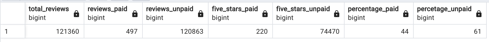

# Review of amazon comments

Analyzing written amazon reviews and the influence from members of the paid Amazon Vine program. This service allows manufacturers to recieve direct reviews to their products from all the members of the program as it's required to publish it. 

Selecting the Healthcare dataset and with the use of PySpark, it will be performed an ETL process to extract the dataset, transform the data, connect it to an AWS RDS instance and load the transformed data into pgAdmin. A further analysis with SQL will determine if there is any bias toward favorable reviews from Vine members in the dataset.

## Results

Having the dataset loaded in pgAdmin, a set of queries (read file 'Vine_Reviews_Analysis.sql') were implemented were data was filtered down where total votes of a product were more than 20, and separated with a conditional statement to count the numbers of 5 stars review of Vine members and non-Vine members.

The following table display the results of the implemented queries and gives an insight on the reviews.

- Total amount of reviews in the Healthcare category were 121360, split bewteen Vine program members and non-Vine members. 

- Vine program: 497 reviews / 220 out of 497 were 5 star reviews / 44 % out of 100% Vine members were 5 stars reviews.

- non-Vine program: 120863 reviews / 74470 out of 120863 were 5 star reviews / 61% out of 100% non-Vine members were 5 stars reviews. 

## Summary 

The Amazon Vine program doesn't seem to represent a big part of the reviews, as 497 out of 121360 were reviews from the members, which could be negligible. 

Additional analysis could be to analyze each product the Vine/non-Vine member ratio to certify there's no bias towards the program and that manufacturers are not tweaking the bar in their favor.
